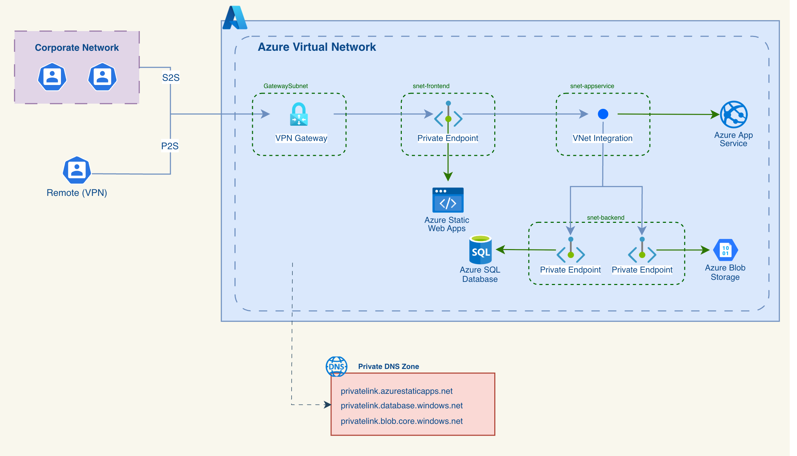

# Architecture Proposal - jta-web.com



The solution follows a **private-by-default** approach using Azure PaaS services. All resources are deployed in **West Europe** and are only accessible via corporate network or VPN.

For this assignment, I chose a flat Terraform structure instead of modules. Since the goal was to demonstrate the proposed infrastructure for the challenge and the resource set is relatively small, using modules would add unnecessary complexity.

## How to run

### 1. Authenticate with Azure

### 2. Initialise Terraform

```bash
terraform init -backend-config=environments/dev/backend.tfbackend
```

### 3. Plan

Review what Terraform will create before applying:

```bash
export TF_VAR_sql_admin_password="<password>"
terraform plan \
  -var-file="environments/dev/dev.tfvars"
```

### 4. Apply

```bash
export TF_VAR_sql_admin_password="<password>"
terraform apply \
  -var-file="environments/dev/terraform.tfvars"
```

## Observability Stack

To monitor jta-web.com we use two Azure native tools:

**Azure Monitor** is the core observability platform. It automatically collects metrics from all Azure resources without additional configuration and is where we define alert rules and dashboards.

**Application Insights** is an extension of Azure Monitor focused on application-level telemetry. It is attached directly to the App Service and gives us visibility into request latency, error rates, and dependency performance.

## Metrics

The metrics we collect vary by resource. The general approach is to focus on signals that directly reflect availability, latency and errors rather than low-level infrastructure metrics like CPU or memory, which are causes to investigate rather than symptoms to alert on.

### Azure App Service

The App Service is the core of the application and is integrated with Application Insights for request-level telemetry.

| Metric | Why |
|---|---|
| Availability | Detects when the API becomes unreachable |
| Request latency | Ensures we meet the SLO of p95 < 300ms |
| HTTP 5xx error rate | Server-side errors directly impacting users |
| Dependency latency | Identifies if slowness comes from the API or a downstream service (SQL, Blob Storage) |

## Alert Rules

Alerts are defined around three categories: availability, latency and error rates. The goal is to alert on symptoms and keep noise low.

### Availability
- API or frontend availability drops below 99% over 5 minutes - immediate action is required

### Latency
- API p95 latency exceeds 250ms over 5 minutes - send a warning to investigate
- API p95 latency exceeds 300ms - active SLO breach

### Error Rates
- HTTP 5xx error rate exceeds 1% over 5 minutes - requires immediate investigation
- SQL connection failures exceed 5 over 5 minutes - API cannot reach the database